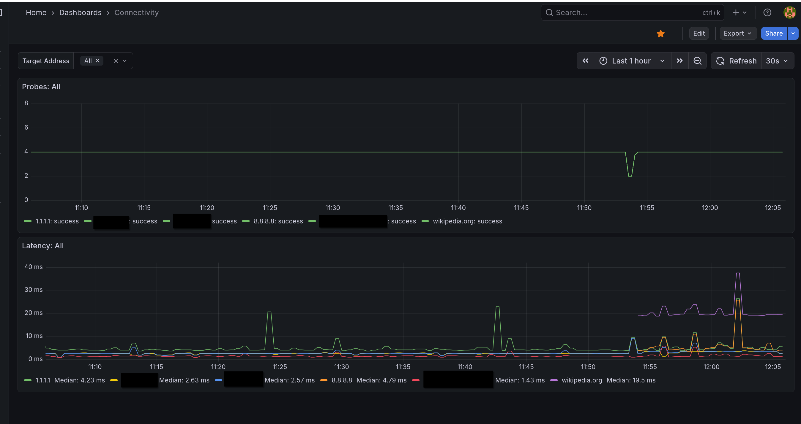

# ping-probe

This is a simple script to continuously ping various hosts and export connectivity metrics in Prometheus format.

I'm using this in my home network for a simple way to monitor responsiveness of the router and several hosts.
See a sample dashboard with connectivity metrics on Grafana:



## Development Setup

This app is built with Pipenv. See https://pipenv.pypa.io/en/latest/ on how to install it.

Set up a virtual environment like so and start a development shell like so:

```sh
pipenv install
pipenv shell
```

The application expects a config.yaml file in the working directory. See config.yaml.example for documentation and an example.
You can copy it to config.yaml to get started.

You can then run the script like so:

```sh
python -m pingprobe
```

Prometheus metrics are served on port 8000 by default:

```sh
curl http://localhost:8000
```

## Building a Container

Create a config.yaml file. See config.yaml.example for documentation and an example.

The container can be built and run as follows, with the config file mounted into it:

```sh
podman build . --build-arg USER=`id -u` -t $image_tag
podman run --rm -ti -v $PWD/config.yaml:/app/config.yaml:z -p 8000:8000 $image_tag
```

# License

MIT, see [LICENSE](LICESE).